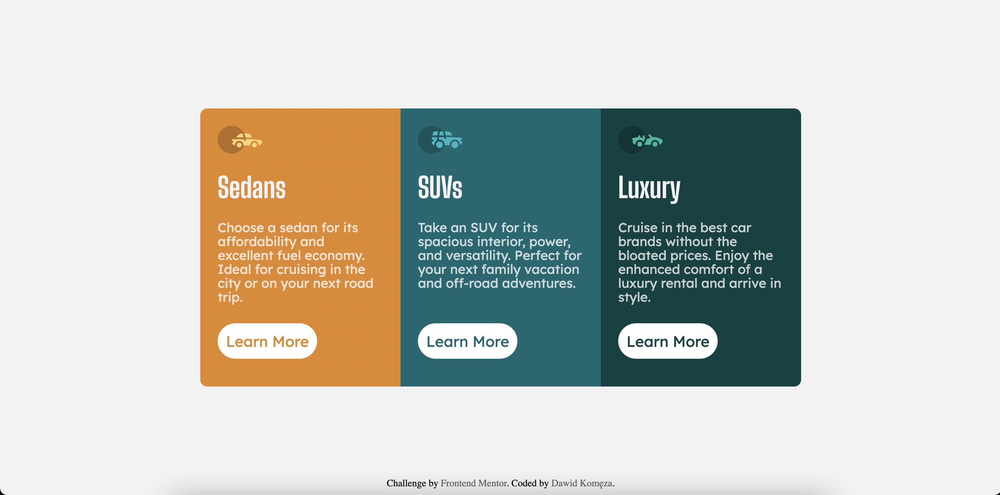

# Frontend Mentor - 3-column preview card component solution

This is a solution to the [3-column preview card component challenge on Frontend Mentor](https://www.frontendmentor.io/challenges/3column-preview-card-component-pH92eAR2-). Frontend Mentor challenges help you improve your coding skills by building realistic projects. 

## Table of contents

- [Overview](#overview)
  - [The challenge](#the-challenge)
  - [Screenshot](#screenshot)
  - [Links](#links)
- [My process](#my-process)
  - [Built with](#built-with)
  - [What I learned](#what-i-learned)
  - [Continued development](#continued-development)
- [Author](#author)

## Overview

### The challenge

Users should be able to:

- View the optimal layout depending on their device's screen size
- See hover states for interactive elements

### Screenshot


### Links

- Solution URL: [Add solution URL here](https://github.com/d4wk0m/3-Column-Preview-Card)
- Live Site URL: [Add live site URL here](https://d4wk0m.github.io/3-Column-Preview-Card/)

## My process

### Built with

- Semantic HTML5 markup
- CSS custom properties
- Flexbox
### What I learned

I've learned how to animate width change, and how to change width on hover.

```css
.card{
    display: flex;
    width: 60%;
    height: 500px;
    border-radius: 10px;
    overflow: hidden;
    position: absolute;
    top: 50%;
    left: 50%;
    transform: translate(-50%,-50%);
    transition: width 0.5s; 
    min-width: 300px;
}

.card:hover{
    width: 65%;
}

.section{
    width: 33%;
    transition: width 0.5s; 
    font-size: 1.5vw;
    overflow: hidden;
    padding: 50px;
}

.section:hover{
    width: 50%;
}
```
### Continued development

I will be focusing on using more flexbox and building more responsive websites

## Author

- Website - [Dawid Komęza](http://dkomeza.great-site.net)
- Frontend Mentor - [@d4wk0m](https://www.frontendmentor.io/profile/d4wk0m)